# Additional documentation

### Digital euro process

Full diagram:

```mermaid
sequenceDiagram
   participant 👩‍🦰 Seller
   participant 📄 SmartContract
   participant 🚀 Fintech
   participant 🏦 DigitalEuro
   participant 👨‍🦲 Buyer

   👩‍🦰 Seller->>📄 SmartContract: Lock stateblecoin
   👨‍🦲 Buyer->>📄 SmartContract: Signal interest
   👨‍🦲 Buyer->>🚀 Fintech: Ask to make Reservation
   🚀 Fintech->> 🏦 DigitalEuro: Makes reservation
   🚀 Fintech->> 📄 SmartContract: Verifies availability
   🚀 Fintech->>📄 SmartContract: Triggers the payment
   🚀 Fintech->> 🏦 DigitalEuro: Triggers the payment
   📄 SmartContract->>👨‍🦲 Buyer: Receives Stablecoin
   🏦 DigitalEuro->>👩‍🦰 Seller: Receives funds
```




Simplified version: 

```mermaid
sequenceDiagram
   participant 👩‍🦰 Seller
   participant 📄 SmartContract
   participant 🏦 DigitalEuro
   participant 👨‍🦲 Buyer

   👩‍🦰 Seller->>📄 SmartContract: Lock stateblecoin
   👨‍🦲 Buyer->>🏦 DigitalEuro: Make reservation
   📄 SmartContract->>👨‍🦲 Buyer: Receives Stablecoin
   🏦 DigitalEuro->>👩‍🦰 Seller: Receives funds
```




### File storage

```sh
docker pull akave/akavelink:latest
docker run -d \
  -p 8000:3000 \
  -e NODE_ADDRESS="connect.akave.ai:5500" \ 
  -e PRIVATE_KEY="your_private_key" \
  akave/akavelink:latest
```
