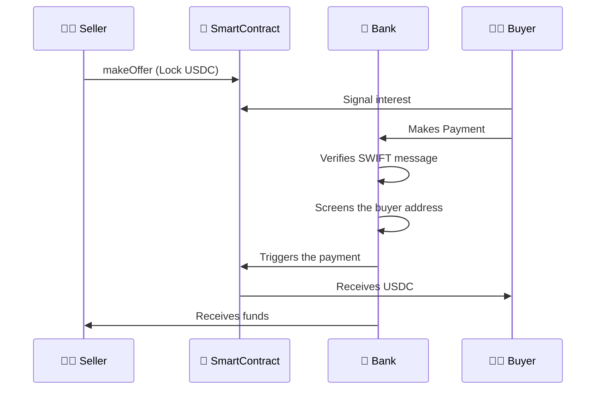
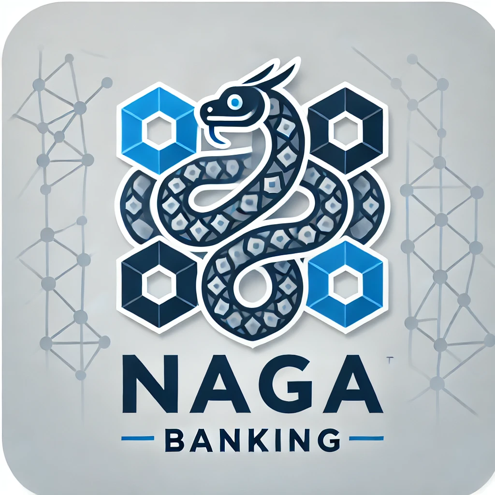

# Naga Banking - Banking Software for Modern Banks 

Naga Banking is a suite facilitating bank operations when interacting with tokenized assets.

*Example scenario:*

Alice, a seller of USDC, uses the interface to formulate an offer. Bob, the buyer, can check the offers, including the KYC information when available.

When Bob pays Alice for a particular offer, Naga Banking can automatically verify the SWIFT message, associate it with the correct offer, screen the buyer's address, and trigger the USDC payment. 




## System Architecture

1. **NagaBank Server**
   - Processes SWIFT messages, verifying payment details
   - Screen buyer addresses
   - Triggers smart contract unlocks (or minting)

2. **Smart Contracts**
   - NagaExchange
      - Manages USDC offers and escrow
      - Handles locking/unlocking of funds
      - Controls offer lifecycle
   - Tokenized Deposit Smart Contract
      - Contains current account for each user registered at the bank

3. **Web Interface**
   - Offer creation interface
   - Offers viewing
   - Bank dashboard


## Technical Stack

### Smart Contracts
- Dev Framework: Hardhat
- Language: Solidity 0.8.26
- KYC information: Kinto KYC viewer
- MPC for privacy of IBANs

### Bank Server
- Runtime: Node.js
- Transaction screening: Circle Compliance Engine
<!-- - Storage: Ayake -->

### Frontend
- Framework: Vanilla JavaScript
- CSS Framework: Milligram.io
- Web3 Library: ethers.js


## Usage

### Launching
```sh
npx hardhat compile
npx hardhat clean #optional

npx hardhat node
npx hardhat ignition deploy ignition/modules/naga.js --network localhost --reset # optional for reset
#liveserver frontend/ # or equivalent
cd server && node index.js mockoffers && nodemon index.js serve ## or nodemon
```

### File storage

```sh
docker pull akave/akavelink:latest
docker run -d \
  -p 8000:3000 \
  -e NODE_ADDRESS="connect.akave.ai:5500" \ 
  -e PRIVATE_KEY="your_private_key" \
  akave/akavelink:latest
```



