# Naga Banking - Banking Software for Modern Banks 

Naga Banking is a software suite facilitating bank operations with tokenized assets, digital currencies, and traditional banking systems.

## Core Capabilities

- **SWIFT-Stablecoin Exchange**: Exchange of money via SWIFT against stablecoins.
- **Digital Euro-Stablecoin Atomic Exchange**: leveraging conditional payments and programmability
- **Multi-Asset Wallet**: Unified interface for digital euros, stablecoins, and traditional forms of money


### Example Scenario

Alice, a seller of a stablecoin, uses the interface to formulate an offer. Bob, the buyer, can check the offers, including the KYC information when available.

When Bob pays Alice for a particular offer, Naga Banking can automatically verify the SWIFT message, associate it with the correct offer, screen the buyer's address, and trigger the stablecoin payment. 

```mermaid
sequenceDiagram
   participant 👩‍🦰 Seller
   participant 📄 SmartContract
   participant 🐍 Bank
   participant 👨‍🦲 Buyer

   👩‍🦰 Seller->>📄 SmartContract: makeOffer (Lock stablecoin)
   👨‍🦲 Buyer->>📄 SmartContract: Signal interest
   👨‍🦲 Buyer->>🐍 Bank: Makes Payment
   🐍 Bank->>🐍 Bank: Verifies SWIFT message
   🐍 Bank->>🐍 Bank: Screens the buyer address
   🐍 Bank->>📄 SmartContract: Triggers the payment
   📄 SmartContract->>👨‍🦲 Buyer: Receives stablecoin
   🐍 Bank->>👩‍🦰 Seller: Receives funds
```




## System Architecture

### 1. Banking Server (`/server`)
   - Process SWIFT messages. Validate payment details.
   - Compliance Engine: address screening.
   - Triggers smart contract operations.
   - DESP Integration.

### 2. Smart Contracts (`/contracts`)
   - NagaExchange: Decentralized marketplace for tokenized asset trades: 
      - Manages USDC offers and escrow
      - Handles locking/unlocking of funds
      - Controls offer lifecycle
   - Stablecoin and tokenized deposits: ERC-20 compatible digital currencies


### 3. Web Interface (`/frontend`)
   - Trading Dashboard: Create and answer to asset offers
   - Bank dashboard: visibility on ongoing accounts and transactions
   

## Technical Stack

### Blockchain Layer
- **Dev Tool**: Hardhat 
- **Language**: Solidity 0.8.26
- **Privacy**: MPC/FHEVM for sensitive data


### Backend Services
- **Runtime**: Node.js with Koa.js 
- **Compliance**: Circle Compliance Engine 

### Frontend & Integration
- **UI**: Vanilla JavaScript
- **Web3**: ethers.js
- **Styling**: Milligram.io 

## Usage

### Launching 
The short version:

```sh
npm i && npm start
```

The long version:

```sh
## Install main node modules and server modules
npm i && cd server && npm i
npm i nodemon -g

## First terminal a hardhat node
npx hardhat node

## Second terminal, reset hardhat and compile. 
npx hardhat clean && npx hardhat compile
npm run deploy # npx hardhat ignition deploy ignition/modules/naga.js --network localhost --reset 

## Third terminal, serve the server
npm run serve # cd server && node index.js mockoffers && nodemon index.js serve 

```
Frontend should be at http://localhost:3000

[additonal documentation](Documentation.md)


