# Naga Banking - Banking Software for Modern Banks 

Naga Banking is a suite facilitating bank operations when interacting with tokenized assets.

Naga suports several scenarios:
- Exchange of money received via SWIFT against a stablecoin
- Atomic exchange digital euro vs Stablecoin, leveraging conditional payment capabilities
- Payment wallet for digital Euro and stablecoins


*Example Scenario*

Alice, a seller of a stablecoin, uses the interface to formulate an offer. Bob, the buyer, can check the offers, including the KYC information when available.

When Bob pays Alice for a particular offer, Naga Banking can automatically verify the SWIFT message, associate it with the correct offer, screen the buyer's address, and trigger the stablecoin payment. 

```mermaid
sequenceDiagram
   participant 👩‍🦰 Seller
   participant 📄 SmartContract
   participant 🐍 Bank
   participant 👨‍🦲 Buyer

   👩‍🦰 Seller->>📄 SmartContract: makeOffer (Lock stablecoin)
   👨‍🦲 Buyer->>📄 SmartContract: Signal interest
   👨‍🦲 Buyer->>🐍 Bank: Makes Payment
   🐍 Bank->>🐍 Bank: Verifies SWIFT message
   🐍 Bank->>🐍 Bank: Screens the buyer address
   🐍 Bank->>📄 SmartContract: Triggers the payment
   📄 SmartContract->>👨‍🦲 Buyer: Receives stablecoin
   🐍 Bank->>👩‍🦰 Seller: Receives funds
```




## System Architecture

1. **NagaBank Server**
   - Processes SWIFT messages, verifying payment details
   - Screen buyer addresses
   - Triggers smart contract unlocks (or minting)

2. **Smart Contracts**
   - NagaExchange
      - Manages USDC offers and escrow
      - Handles locking/unlocking of funds
      - Controls offer lifecycle
   - Tokenized Deposit Smart Contract
      - Contains current account for each user registered at the bank

3. **Web Interface**
   - Offer creation interface
   - Offers viewing
   - Bank dashboard


## Technical Stack

### Smart Contracts
- Dev Framework: Hardhat
- Language: Solidity 0.8.26
- KYC information: Kinto KYC viewer
- MPC for privacy of IBANs

### Bank Server
- Runtime: Node.js
- Transaction screening: Circle Compliance Engine
<!-- - Storage: Ayake -->

### Frontend
- Framework: Vanilla JavaScript
- CSS Framework: Milligram.io
- Web3 Library: ethers.js


## Usage

### Launching

The short version:

```sh
npm i && npm start
```

The long version:

```sh
## Install main node modules and server modules
npm i && cd server && npm i
npm i nodemon -g
## First terminal a hardhat node
npx hardhat node
## Second terminal, reset hardhat and compile. 
npx hardhat clean && npx hardhat compile
npx hardhat ignition deploy ignition/modules/naga.js --network localhost --reset # or npm run deploy

## Third terminal, serve the server
cd server && node index.js mockoffers && nodemon index.js serve ## or npm run serve
```

[additonal documentation](Documentation.md)


