# Naga Banking - Additional Documentation

## Digital Euro Atomic P2P

### Complete Process Flow

```mermaid
sequenceDiagram
   participant 👩‍🦰 Seller
   participant 📄 SmartContract
   participant 🚀 Server
   participant 🏦 DigitalEuro
   participant 👨‍🦲 Buyer

   👩‍🦰 Seller->>📄 SmartContract: Lock stablecoin
   👨‍🦲 Buyer->>📄 SmartContract: Signal interest
   👨‍🦲 Buyer->>🚀 server: Request reservation
   🚀 server->>🏦 DigitalEuro: Create reservation
   🚀 server->>📄 SmartContract: Verify offer availability
   🚀 server->>🏦 DigitalEuro: Trigger payment
   🚀 server->>📄 SmartContract: Trigger unlock
   📄 SmartContract->>👨‍🦲 Buyer: Transfer stablecoin
   🏦 DigitalEuro->>👩‍🦰 Seller: Transfer digital euros
```



### Simplified diagram

```mermaid
sequenceDiagram
   participant 👩‍🦰 Seller
   participant 📄 SmartContract
   participant 🏦 DigitalEuro
   participant 👨‍🦲 Buyer

   👩‍🦰 Seller->>📄 SmartContract: Lock stablecoin
   👨‍🦲 Buyer->>🏦 DigitalEuro: Make reservation 
   📄 SmartContract->>👨‍🦲 Buyer: Receive stablecoin
   🏦 DigitalEuro->>👩‍🦰 Seller: Receive digital euros
```




### File Storage

```sh
docker pull akave/akavelink:latest
docker run -d \
  -p 8000:3000 \
  -e NODE_ADDRESS="connect.akave.ai:5500" \
  -e PRIVATE_KEY="your_private_key" \
  akave/akavelink:latest
```
